#  Project 3: Web APIs & NLP

## Contents:
- [Background](#Background)
- [Problem Statement](#Problem-Statement)
- [Datasets](#Datasets)
- [Data Dictionary](#Data-Dictionary)
- [External Research](#External-Research)
- [Executive Summary](#Executive-Summary)
- [Data Cleaning](#Data-Cleaning)
- [Exploratory Data Analysis & Feature engineering](##Exploratory-Data-Analysis-&-Feature-engineering)
- [Modelling](#Modelling)
- [Baseline Accuracy](#Baseline-Accuracy)
- [Multinomial Naive Bayes model](#Multinomial-Naive-Bayes-model)
- [KNearestNeighbors model](#KNearestNeighbors-model)
- [Random Forest model](#Random-Forest-model)
- [Score Summary](#Score-Summary)
- [Conclusion](#Conclusion)

---
## Background

Growing consciousness for health and wellness among American customers has been driving rapid changes in the food business. According to L.E.K. Consulting’s 2018 food and beverage survey, 93% of consumers want to eat healthy at least some of the time, with 63% trying to eat healthy most or all of the time. Health-oriented food primarily includes fresh, natural, additive-free and sustainably produced food.1
Especially during the Covid-19 pandemic, studies shown that there is an improvement in healthy meal consumption pattern and a restriction of unhealthy food items was observed, especially in the younger population (age <30 years) in India.2

---
## Problem Statement

Healthy eating behavior have been gaining popularity especially during the COVID-19 pandemic. With the rapid technology advancement, people are easily exposed to new information via social media and popular forums such as Reddit. However with the limitless information, it can overwhelm newcomers, who are looking to adopt a healthy diet, with an overload of information while searching for suitable diets. 'Healthy Eats', a company whose mission is to create awareness on healthy diets for consumers, owns a forum with multiple diet categories have approached GA data science team (which I am in), to create and train a model that can identify keywords and classify posts into the correct diet category taking reference from two popular subreddit, Vegan and Keto.

---
## Datasets
These are the datasets used for this project.
* [`keto_final_df.csv`](./datasets/Keto_final_df.csv): Dataset containing 1000 posts scrapped from Keto subreddit after removing [deleted],[removed] and empty posts.
* [`vegan_final_df.csv`](./datasets/vegan_final_df.csv):Dataset containing 1000 posts scrapped from Vegan subreddit after removing [deleted],[removed] and empty posts.
* [`final_data.csv`](./datasets/final_data.csv): Combined dataset of both vegan and keto, with text and title concatenated and  lemmatized.

---
## Data Dictionary
|Column|Dataset|Data Description|
|---|---|---|
|subreddit|final_data.csv|Subreddit of post taken from with (0: Vegan, 1: Keto)|
|lemm_words|final_data.csv|Lemmertized words of cleaned title and posts concatenated|

---
## External Research

Subreddit '*r/Vegan*', was created on 31 March, 2008. A short description about the community involved:

- Veganism: "A philosophy and way of living which seeks to exclude—as far as is possible and practicable—all forms of exploitation of, and cruelty to, animals for food, clothing or any other purpose; and by extension, promotes the development and use of animal-free alternatives for the benefit of humans, animals and the environment. In dietary terms it denotes the practice of dispensing with all products derived wholly or partly from animals." - The Vegan Society3

With approximately 592,000 members in the community, posts in the subreddit are mainly about 'advice', 'activism', 'discussion', 'food', 'health'.

Subreddit 'r/Keto' was created on 27 May 2010. A short description about the community involved:

- The Ketogenic Diet is a low carbohydrate method of eating. /r/keto is place to share thoughts, ideas, benefits, and experiences around eating within a Ketogenic lifestyle. Helping people with diabetes, epilepsy, autoimmune disorders, acid reflux, inflammation, hormonal imbalances, and a number of other issues, every day.4

Even though the subreddit was created much later, it has approximately 2,400,000 members in the community. Almost 4 times the number of users for Vegan. The subreddit posts are mainly revolving around 'Success story', 'Food and recipe', 'Help', 'medical'.

---
## Executive Summary

During April 2021, GA Data Science Team successfully created and train a model taking reference from two popular lifestyle subreddits, Keto and Vegan. The model is able to correctly classify posts by identifying key words with an accuracy of 96.58%.

The team started off with scrapping posts from both subreddits and in the midst of it, removing posts that were either deleted, removed by administrator or empty. This simplifies the process of gathering informative posts.   

After sufficient data was scrapped, further cleaning was done to remove certain unwanted features such as emojis, symbols etc. Once cleaning is done, EDA was next in line for example, comparing word counts between the two subreddits, doing sentimental analysis and identifying top mentioned words.

Next up would be to modeling, the team experimented with 3 classification machine learning models, 'Multinomial Naive Bayes', 'KNearestNeighbors' & 'Random Forest'. From there, we selected the model that fits our goal.

---
## Data Cleaning

A function was created to do simple cleaning,:
- lower case
- identify email addresses and removing them.
- removal of white spaces
- removal of special characters
- removal of HTML special entities(e.g. \&amp;)
- removal of emojis

---
## Exploratory Data Analysis & Feature engineering

**Word count comparison**

New column with word count of each post was created. From there, histograms were created and compare.

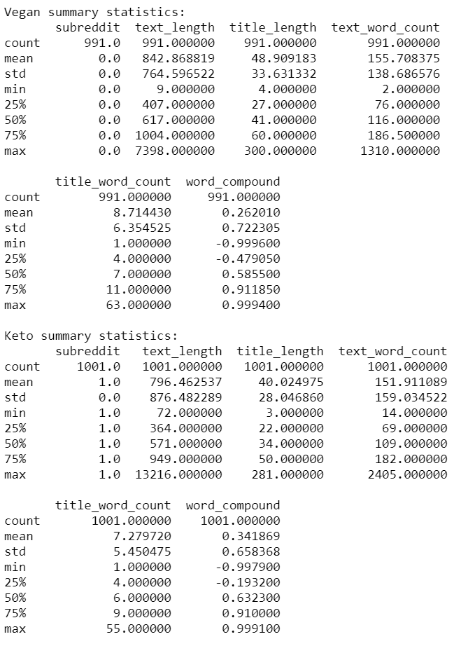
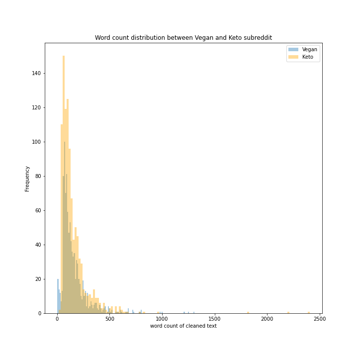
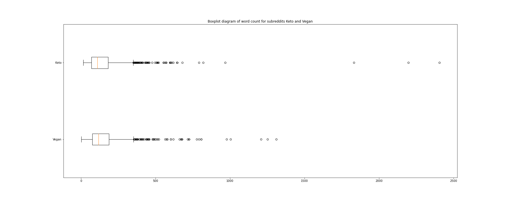

We can observed that from the distribution plot, Keto have much more coverage in terms of area under graph as compared to Vegan. Also from the summary table, we could see that Vegan has 1002 entries while Keto has 1045 entries. Both have fairly similar count of entries. However if we look closer into the combined histogram, we can see that vegan have quite a number of posts standing out with word count of 50 and below. The boxplot tells us about the distribution from another angle, here we can see that there are a lot of outliers from approximately 400 to 500 word counts. We can observe that Keto have 3 extreme outliers with approximately 1900 words above. Stop words may have contributed to the count for the outliers. Outliers could be posts that are guides written on the individual topic therefore I have chosen not to remove them.

**Sentimental Analysis**

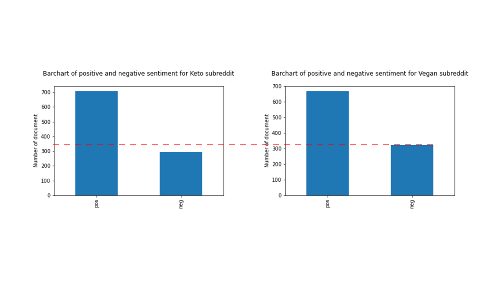

Both subreddits have majority positive posts however, there seem to be more negative posts in Vegan. This is understandable as it could be referring to posts of people sharing their views about animal cruelty, or ranting about unable to garner enough support from their friends and families. This may have led the model to generate these scores.

**Identification of keywords**

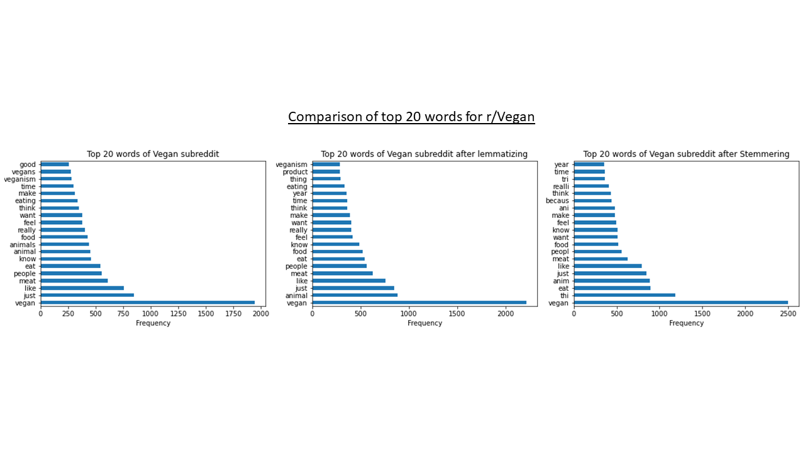
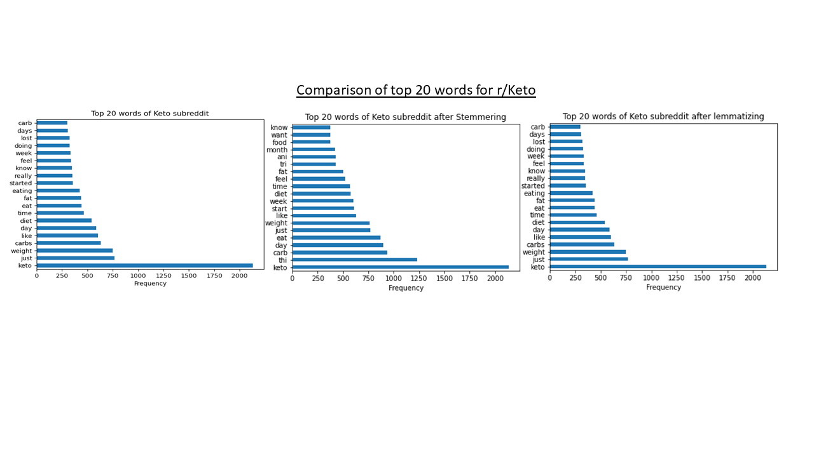

The top 20 mentioned words in Vegan includes food, animal, animals, meat, people, eat, vegan.

The top 20 mentioned words in Keto includes fat, diet, carbs, weight, keto.

From here, we can see vegan is mainly talking about animals while keto is about diet. We may be able to guess which subreddit a post belongs to but it is still very vague to really pinpoint based on the given key words.

---

## Modelling

#### Baseline Accuracy

The baseline accuracy is the percentage of the majority class, regardless of whether it is 1 or 0. It serves as the benchmark for our model to beat which is at 0.502008.

Our main goals/concerns are to:

1. High accuracy of classification
2. Increase the True Negative count.
3. Reduce False Negative (Type II Error).
4. Increase Specificity score.
5. Increase Sensitivity score.

The reason is because type II Error would mean that a post from the subreddit 'Keto' is being classified as 'Vegan'.
Ethical vegans strongly believe that all creatures have the right to life and freedom. Therefore, they oppose ending a conscious being's life simply to consume its flesh, drink its milk, or wear its skin — especially because alternatives are available. Whereas Keto diet consist of about 75% fat, 10-30% protein and no more than 5% or 20 to 50 grams of carbs per day. Focus on high-fat, low-carb foods like **eggs, meats, dairy** and low-carb vegetables, as well as sugar-free beverages. Therefore, it would be disastrous to classify a Keto post as Vegan.

### Multinomial Naive Bayes model

Naive Bayes is a statistical classification technique based on Bayes Theorem. It is one of the simplest supervised learning algorithms. Naive Bayes classifier is the fast, accurate and reliable algorithm. Naive Bayes classifiers have high accuracy and speed on large datasets.
Naive Bayes classifier calculates the probability of an event in the following steps:

- Step 1: Calculate the prior probability for given class labels
- Step 2: Find conditional probability with each attribute for each class
- Step 3: Multiply same class conditional probability.
- Step 4: Multiply prior probability with step 3 probability
- Step 5: See which class has a higher probability, given the input belongs to the higher probability class.5

##### With Countvectorizer

CountVectorizer is used to convert a collection of text documents to a vector of term/token counts. It also enables the ​pre-processing of text data prior to generating the vector representation. This functionality makes it a highly flexible feature representation module for text.6

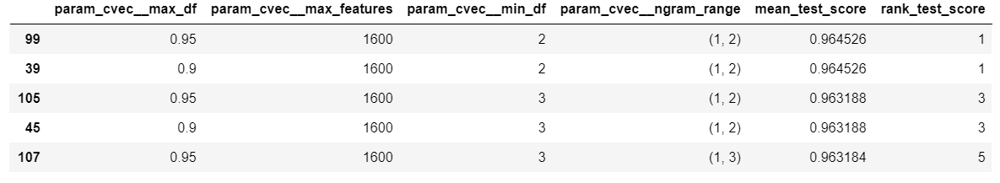

These are the top 5 results of GridSearchCV with customized cvec parameters.

- param_cvec_max_df: This parameter ignore terms that have a document
    frequency strictly higher than the given threshold. Using the first ranking model,  0.95 would represent 95%. Meaning to say if a word have a frequency above 95%, it would be ignored.

- param_cvec_max_features: This parameter only consider the top
    max_features ordered by term frequency across the corpus. Using the first ranking model as an example, 1600 would mean the top 1600 in terms of frequency.

- param_cvec_min_df: This parameter ignore terms that have a document
    frequency strictly lower than the given threshold. Using the first ranking model, 2 would represent any word that appear less than twice will be ignored as well.

- param_cvec_ngram_range: This parameter determines what  𝑛 -grams should be considered as features. Using the first ranking model as an example, (1,2) means it will capture every 1-gram and every 2-grams.

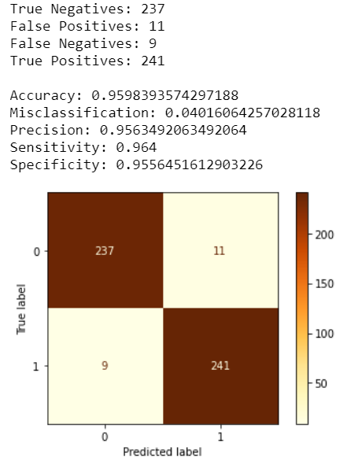

##### Interpretation

The scores of this model is:
- Accuracy: 0.9598
- True Negative: 237
- False Negative: 9
- Specificity: 0.9556
- Sensivitity: 0.964

The training and test accuracy scores for this model are 96.92%, 95.98% respectively indicating that the model is well fitted as the scores are fairly similar, the false negative count indicates that 9 keto posts are wrongly classified as vegan and true negative count indicates the number of vegan post predicted correctly. Specificity score is at 95.56% indicating the accuracy of predicted vegan posts that were correctly identified. Sensitivity score is at 96.4%, representing the number of Keto posts being identified correctly.

##### With TF-IDF Vectorizer
TF-IDF are word frequency scores that try to highlight words that are more interesting, e.g. frequent in a document but not across documents.

  The TfidfVectorizer will tokenize documents, learn the vocabulary and inverse document frequency weightings, and allow you to encode new documents.7

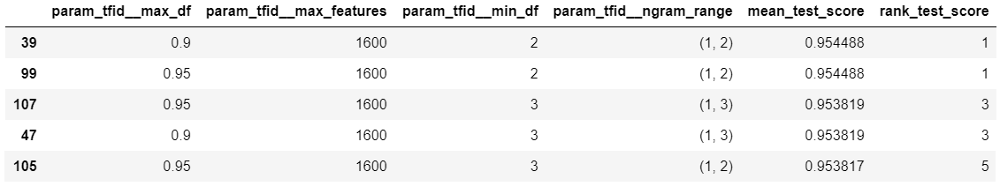

These are the top 5 results of GridSearchCV with customized tfidf parameters and MultinomialNB.

Similarly to CountVectorizer, the parameters are similar:

- param_tfid_max_df: This parameter ignore terms that have a document
    frequency strictly higher than the given threshold. Using the first ranking model,  0.90 would represent 90%. Meaning to say if a word have a frequency above 90%, it would be ignored.

- param_tfid_max_features: This parameter only consider the top
    max_features ordered by term frequency across the corpus. Using the first ranking model as an example, 1600 would mean the top 1600 in terms of frequency.

- param_tfid_min_df: This parameter ignore terms that have a document
    frequency strictly lower than the given threshold. Using the first ranking model, 2 would represent any word that appear less than twice will be ignored as well.

- param_tfid_ngram_range: This parameter determines what  𝑛 -grams should be considered as features. Using the first ranking model as an example, (1,2) means it will capture every 1-gram and every 2-grams.

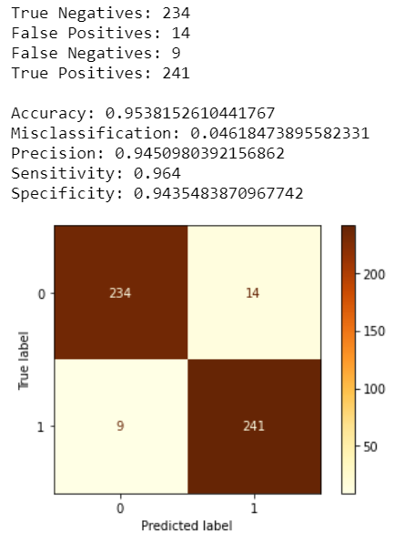

##### Interpretation

The scores of this model are:

- Accuracy: 0.9538
- True Negative: 234
- False Negative: 9
- Specificity: 0.9435
- Sensitivity: 0.964

The training and test accuracy scores for this model are 96.78%, 95.38% respectively indicating that the model is well fitted as both scores are fairly similar, the false negative count retain at 9 but true negative count has also drop to 234. This indicates that more Vegan post are wrongly classified as Keto. Specificity score also dropped to 94.35% as mentioned previously that true negative count has dropped and sensitivity retained at 96.4%.

---

### KNearestNeighbors model

KNN works by finding the distances between a query and all the examples in the data, selecting the specified number examples (K) closest to the query, then votes for the most frequent label (in the case of classification)8

##### With Countvectorizer

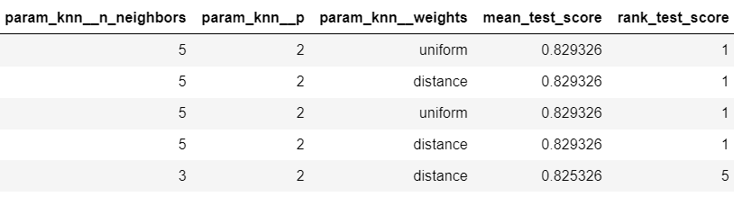

These are the top 5 results of GridSearchCV with customized cvec parameters and KNearestNeighbors. The cvec params that were customized are the same,

- param_knn_n_neighbors: Number of neighbors to use. With reference to the first ranking model, 5 neighbors were used in that model.

- param_knn_p: The type of metric used where 2 represents euclidean_distance.

- param_knn_weights: Uniform representing all points in each neighborhood are weighted equally whereas Distance weight points by the inverse of their distance, closer neighbors of a query point will have a greater influence than neighbors which are further away.

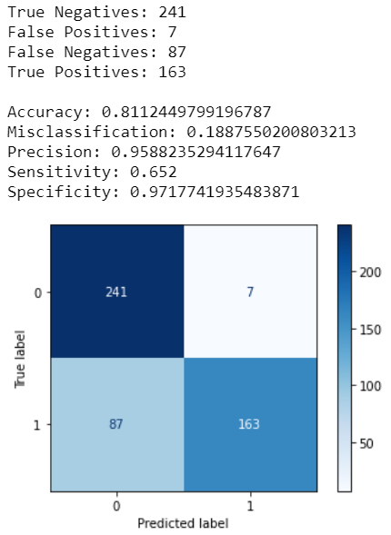

##### Interpretation

- Accuracy: 0.8112
- True Negative: 241
- False Negative: 87
- Specificity: 0.9717
- Sensitivity: 0.652

The training and test accuracy scores for this model are 87.55% and 81.12% respectively suggesting that the model is overfitted. The false negative count have increase to 87 contributing to the drop in sensitivity score to 65.2%. This is a fairly bad model as other than the false positive count moving in the right direction, all other counts were going towards the opposite direction.

##### With TF-IDF Vectorizer
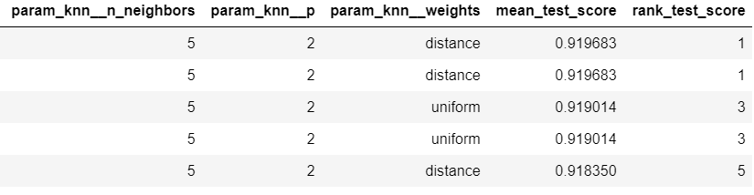

These are the top 5 results of GridSearchCV with customized tfidf parameters and KNearestNeighbors.

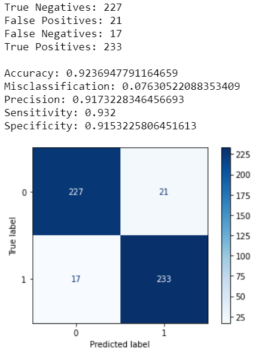

##### Interpretation

- Accuracy: 0.9236
- True Negative: 227
- False Negative: 17
- Specificity: 0.9153
- Sensitivity: 0.932

The training and test accuracy scores for this model are 100%, 92.36% respectively indicating that the model is overfitted.
The false negative count has dropped to 17 as compared to the previous model, contributing to the rise of sensitivity score to 93.2%. Specificity score is at 91.53% indicating the accuracy of predicted vegan posts that were correctly identified.
These are the top 5 results of GridSearchCV with customized cvec parameters and KNearestNeighbors.

### Random Forest model

The random forest is a classification algorithm consisting of many decisions trees. It uses bagging and feature randomness when building each individual tree to try to create an uncorrelated forest of trees whose prediction by committee is more accurate than that of any individual tree.9

##### With Countvectorizer

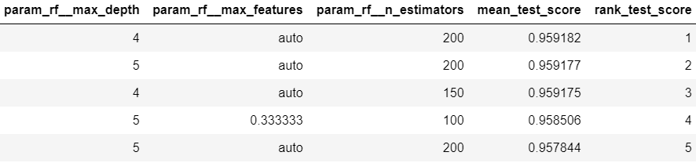

These are the top 5 results of GridSearchCV with customized cvec parameters and Random Forest. Using the same customized cvec parameters, let us go through the random forest parameters that were customized:

- param_rf_max_depth: The maximum depth of the tree. Using the first ranking model, this means that the model has a depth of 4.

- param_rf_max_features: The number of features to consider when looking for the best split:
  - If float, then `max_features` is a fraction and `int(max_features * n_features)` features are considered at each split.
  - If "auto", then `max_features=sqrt(n_features)`.
  - If "sqrt", then `max_features=sqrt(n_features)` (same as "auto").
  - If "log2", then `max_features=log2(n_features)`.

  The first ranking model uses auto which means its the square root of the number of features.

- param_rf_n_estimators: The number of trees in the forest. Referencing from the first ranking model, there are 200 trees in the model.

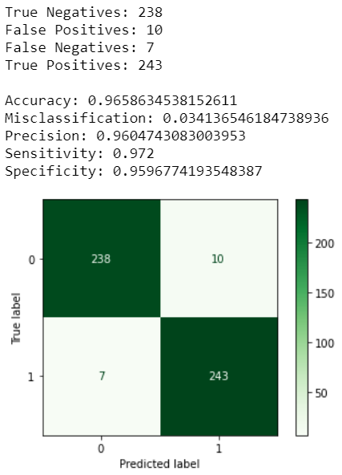

##### Interpretation

- Accuracy: 0.9658
- True Negative: 238
- False Negative: 7
- Specificity: 0.9596
- Sensitivity: 0.972

The training and test accuracy scores for this model are 96.38% and 96.58% respectively indicating that the model is well fitted as the scores are very similar. The false negative count have improved to 7 which probably carried the sensitivity score to 97.20% which is the highest compared to the other previous models. The predicted vegan post that were correctly identified(True negative) is at 238 and specificity score 95.96%.

##### With TF-IDF Vectorizer

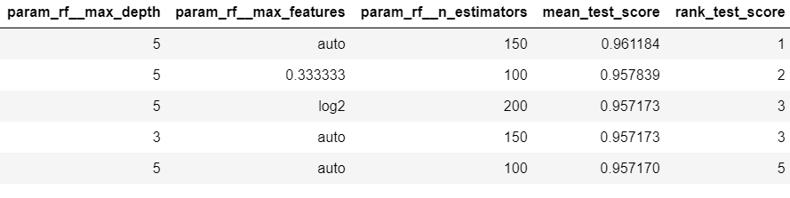

These are the top 5 results of GridSearchCV with customized tfidf parameters and Random Forest

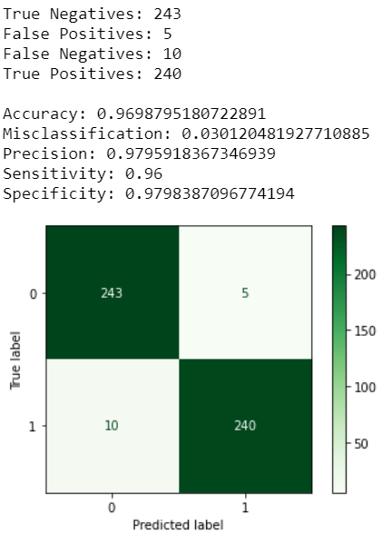

##### Interpretation

- Accuracy: 0.9698
- True Negative: 243
- False Negative: 10
- Specificity: 0.9798
- Sensitivity: 0.96

The training and test accuracy scores for this model are 96.45%, 96.98% respectively indicating that the model is well fitted as the scores are very similar. The true negative count and specificity score are decently well at 243 and 97.98%.
Pairing it with low False negative count and high sensitivity score at 10 and 96%.

---

## Score Summary

|                   Model |       Transformer | Training Score | Test Score | Specificity | Sensitivity | True Negative | False Positive | False Negative | True Positive |
|------------------------:|------------------:|---------------:|-----------:|------------:|------------:|--------------:|---------------:|---------------:|--------------:|
|                Baseline |                 - |         0.5020 |          - |           - |           - |             - |              - |              - |             - |
| Multinomial Naive Bayes |   CountVectorizer |         0.9692 |     0.9598 |      0.9556 |      0.9640 |           237 |             11 |              9 |           241 |
| Multinomial Naive Bayes | TF-IDF Vectorizer |         0.9678 |     0.9538 |      0.9435 |      0.9640 |           234 |             14 |              9 |           241 |
|       KNearestNeighbors |   CountVectorizer |         0.8755 |     0.8112 |      0.9717 |      0.6520 |           241 |              7 |             87 |           163 |
|       KNearestNeighbors | TF-IDF Vectorizer |            1.0 |     0.9236 |      0.9153 |      0.9320 |           227 |             21 |             17 |           233 |
|           Random Forest |   CountVectorizer |         0.9638 |     0.9658 |      0.9596 |      0.9720 |           238 |             10 |              7 |           243 |
|           Random Forest | TF-IDF Vectorizer |         0.9645 |     0.9698 |      0.9798 |      0.9600 |           243 |              5 |             10 |           240 |

---

## Conclusion

To revisit what our main goals/concerns are:

- High accuracy of classification
- Increase the True Negative count.
- Reduce False Negative (Type II Error).
- Increase Specificity score.
- Increase Sensitivity score.

My model of choice would be the Second last model, Random Forest paired with Countvectorizer. Reason being is that
even though the last model (Random forest with TF-IDF Vectorizer) had achieve slightly better scores on some aspects, The chosen model had better scores on *True Positive count* ,*False Negative count* and *sensitivity score*.

 - A higher *True Positive count* would dictate that more Keto posts are predicted correctly.
 - A lower *False Negative count* would dictate that lesser predicted Keto post to be Vegan.
 - A higher *Sensitivity score* would dictate accuracy of Keto posts that were correctly identified.

To refresh our memory:

These scores are crucial as ethical vegans have strong beliefs that all creatures have the right to life and freedom. Therefore, they oppose ending a conscious being's life simply to consume its flesh, drink its milk, or wear its skin — especially because alternatives are available. And people who are into Keto do not have any concern where they get their nutrition from, be it plants or animals as long as their nutrition requirement has been fulfilled. Therefore we take the mentioned scores into serious consideration to mitigate the risk of Keto posts being classified as Vegan for our client.   

However, as there are still room for improvement in the model that we have explored. We can further improve our model with more data (posts being scrapped) or even increase the time horizon of the data scrapped to probably 2-3 years post's age. This is because forums usually have lingos so we might be able to capture such lingos used in different subreddit to help increase the accuracy. We can also explore using boosting in models such as XGBoost to see if they yield better results.

---

## Citations

1[Restolabs Team,(2021) Restaurant Guide: The Rising Trend Of Health Food Businesses And How You Can Be A Part Of It](https://www.restolabs.com/blog/restaurant-guide-rising-trend-health-food-businesses-and-how-you-can-be-part-it)
 
2[National Center for Biotechnology Information
Search database,(6 Oct 2020) Impact of COVID-19 on lifestyle-related behaviours- a cross-sectional audit of responses from nine hundred and ninety-five participants from India](https://www.ncbi.nlm.nih.gov/pmc/articles/PMC7537601/)
 
3[Reddit Inc,(2021) r/Vegan - the largest vegan community on the internet!](https://www.reddit.com/r/vegan/)
 
4[Reddit Inc,(2021) Keto: The Home for Ketogenic Diets](https://www.reddit.com/r/keto/)
 
5[Avinash Navlani,(December 4th, 2018) Naive Bayes Classification using Scikit-learn](https://www.datacamp.com/community/tutorials/naive-bayes-scikit-learn)
 
6[Educative, Inc.,(2021) CountVectorizer in Python](https://www.educative.io/edpresso/countvectorizer-in-python)
 
7[Jason Brownlee,(September 29,2017) How to Encode Text Data for Machine Learning with scikit-learn](https://machinelearningmastery.com/prepare-text-data-machine-learning-scikit-learn/#:~:text=Without%20going%20into%20the%20math,you%20to%20encode%20new%20documents.)
 
8[Onel Harrison,(September 11, 2018) Machine Learning Basics with the K-Nearest Neighbors Algorithm](https://towardsdatascience.com/machine-learning-basics-with-the-k-nearest-neighbors-algorithm-6a6e71d01761#:~:text=KNN%20works%20by%20finding%20the,in%20the%20case%20of%20regression).)
 
9[Tony Yiu,(June 12, 2019) Understanding Random Forest](https://towardsdatascience.com/understanding-random-forest-58381e0602d2#:~:text=The%20random%20forest%20is%20a,that%20of%20any%20individual%20tree.)
